<p align="center">
  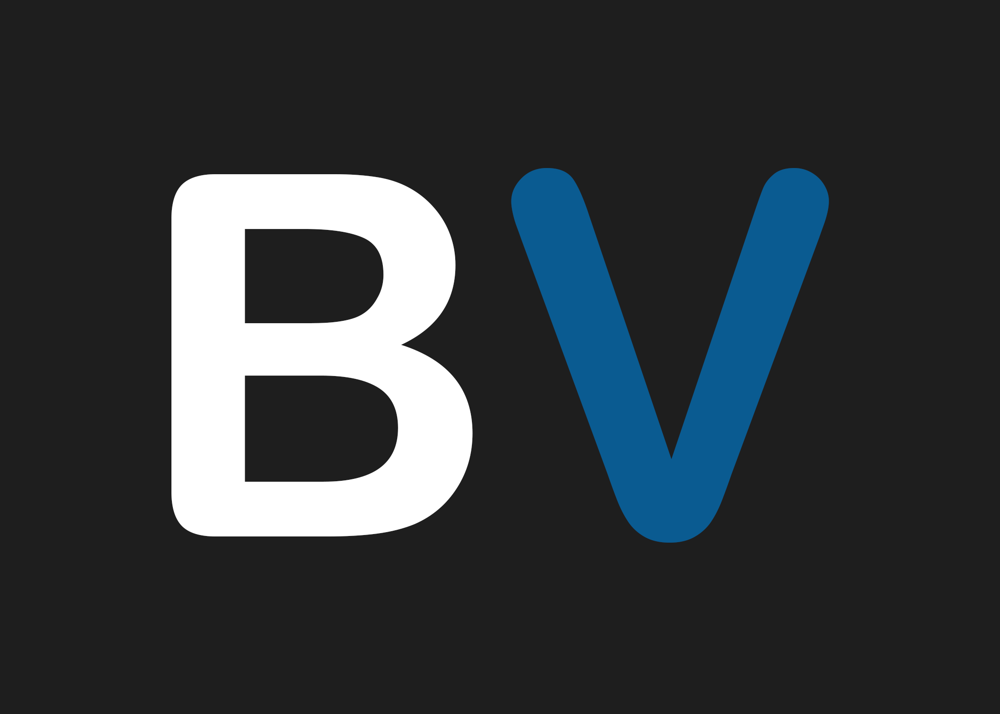
</p>

<h1 align="center">BlastAdmin</h1>

<p align="center">
  <b>The Pipeline TD administration tool for BlastVault studios.</b><br>
  Manage your studio name, artist registry, departments, and admin PIN from one small desktop app.
</p>

<p align="center">
  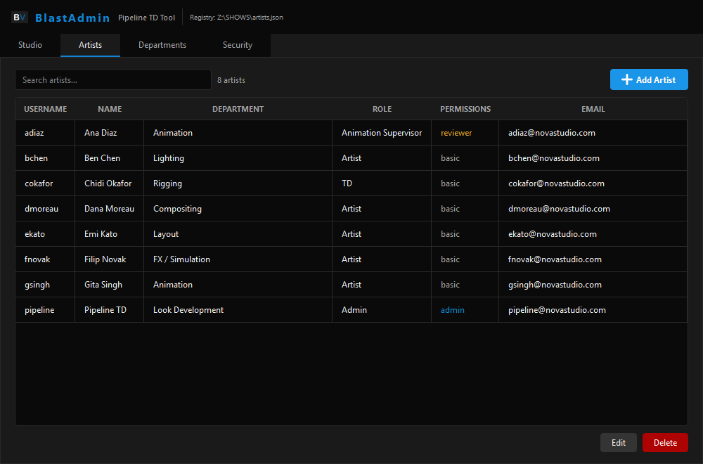
</p>

---

## Contents

- [Overview](#overview)
- [Features](#features)
- [Requirements](#requirements)
- [Installation](#installation)
- [Running BlastAdmin](#running-blastadmin)
- [First Launch Walkthrough](#first-launch-walkthrough)
- [Using BlastAdmin](#using-blastadmin)
  - [Studio tab](#studio-tab)
  - [Artists tab](#artists-tab)
  - [Departments tab](#departments-tab)
  - [Security tab](#security-tab)
- [How Data Is Stored](#how-data-is-stored)
  - [The shared registry — `artists.json`](#the-shared-registry--artistsjson)
  - [Local config — `bladmin_config.json`](#local-config--bladmin_configjson)
  - [How the registry path is resolved](#how-the-registry-path-is-resolved)
- [Permissions & Roles](#permissions--roles)
- [Project Structure](#project-structure)
- [Theming](#theming)
- [Packaging as an Executable](#packaging-as-an-executable)
- [Troubleshooting](#troubleshooting)
- [Security Notes](#security-notes)

---

## Overview

**BlastAdmin** is a companion app to **BlastVault**. BlastVault is the tool artists use every day. BlastAdmin is what the Pipeline TD uses to set up and maintain the data BlastVault depends on:

| What                  | Where it lives                                  |
|-----------------------|-------------------------------------------------|
| Studio name           | Shared registry (`artists.json`) + local config |
| Artist roster         | Shared registry (`artists.json`)                |
| Department list       | Shared registry (`artists.json`) + local config |
| Admin PIN (hashed)    | Shared registry (`artists.json`) + local config |

BlastAdmin **does not import or depend on BlastVault**. It reads and writes `artists.json` directly. That file normally sits on a shared network drive, so a change made in BlastAdmin reaches every workstation the next time BlastVault launches.

---

## Features

- **Studio setup:** set the studio name and point to the shared registry file, with live feedback on whether the file exists and how many artists it contains.
- **Artist management:** add, edit, and delete artists. You can search across every field, edit with a double-click, and use a right-click context menu.
- **Permission levels:** give each artist `admin`, `reviewer`, or `basic` access. Each level is colour-coded in the table.
- **Department management:** keep the list of departments shown in artist dropdowns up to date. It comes pre-filled with 15 standard animation-pipeline departments.
- **Admin PIN:** set, change, or remove a PIN. It locks BlastAdmin on launch and is shared with BlastVault so artists can unlock status editing.
- **First-run wizard:** a welcome dialog walks a new TD through the initial setup.
- **Safe registry handling:** an existing `artists.json` is never overwritten with an empty artist list. Only the fields you change are updated.
- **Dark theme:** the colour palette matches BlastVault, so the two apps feel like one suite.
- **High-DPI aware:** the UI stays crisp on 4K and scaled displays.

---

## Requirements

| Requirement | Version                                           |
|-------------|---------------------------------------------------|
| Python      | **3.10 or newer** (the code uses `X \| None` type syntax) |
| PyQt5       | 5.15+                                             |
| OS          | Windows 10/11 (primary), macOS, Linux             |

The only third-party dependency is **PyQt5**.

---

## Installation

```bash
# 1. Clone the repository
git clone <your-repo-url> BlastAdmin
cd BlastAdmin

# 2. (Recommended) create a virtual environment
python -m venv .venv
# Windows
.venv\Scripts\activate
# macOS / Linux
source .venv/bin/activate

# 3. Install the dependency
pip install PyQt5
```

---

## Running BlastAdmin

```bash
python main.py
```

On launch, BlastAdmin:

1. Loads its local config (`bladmin_config.json`).
2. Reads the admin PIN hash from `artists.json` if the local config doesn't have one.
3. Shows the **First-Run** dialog if no local config exists yet.
4. Asks for the **admin PIN** if one is set.
5. Opens the main window.

---

## First Launch Walkthrough

### 1. Welcome dialog

On the very first launch (when no `bladmin_config.json` exists), you'll see the welcome dialog:

<p align="center">
  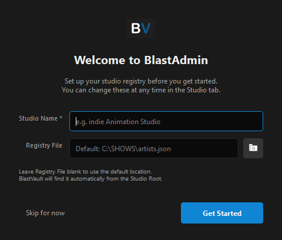
</p>

| Field             | Description                                                                                                  |
|-------------------|--------------------------------------------------------------------------------------------------------------|
| **Studio Name \*** | Required. Stored in both the local config and `artists.json`.                                               |
| **Registry File** | Optional. Full path to `artists.json`. Leave it blank to use `<Studio Root>\artists.json` (default `C:\SHOWS\artists.json` on Windows, `~/Shows/artists.json` elsewhere). |

- **Get Started** saves your settings. If the registry file already exists (for example, a registry that's already on the network), its artists are kept and only `studio_name` is updated. If it doesn't exist, BlastAdmin creates a new empty registry at that path.
- **Skip for now** closes the dialog without saving anything. You can fill everything in later on the **Studio** tab.

### 2. PIN prompt

If an admin PIN has been set, BlastAdmin asks for it every time it starts:

<p align="center">
  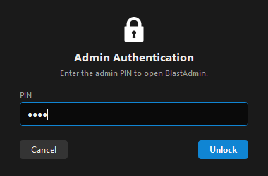
</p>

A wrong PIN clears the field and shows an error. **Cancel** closes the application.

---

## Using BlastAdmin

The main window has a header bar with the **active registry path**. If the file can't be found, the path turns red and shows `⚠ file not found`. Below the header are four tabs.

### Studio tab

<p align="center">
  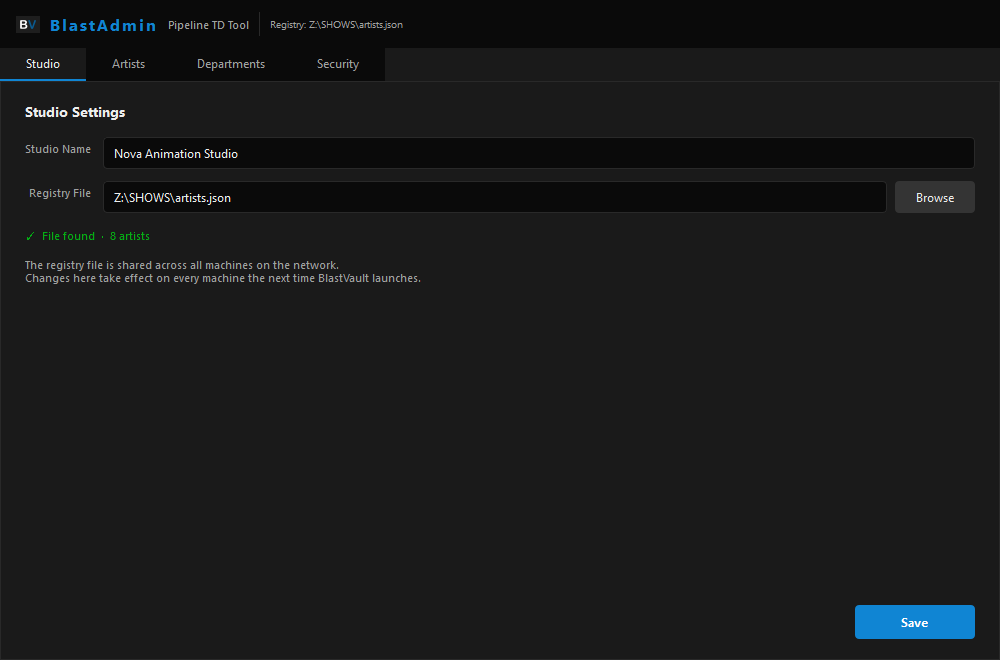
</p>

Use this tab to set the **studio name** and the **registry file** location.

- **Registry File:** type a path or click **Browse** to pick an existing `.json` file. The status line below updates as you type:
  - `✓ File found · N artists` (green): the file exists and can be read.
  - `⚠ File not found at this path` (red): nothing exists at that path.
  - `⚠ File found but could not be read` (red): the file exists but isn't valid JSON.
  - If you leave the field blank, BlastAdmin checks the default `<Studio Root>\artists.json` instead.
- **Save** writes the local config. It updates `studio_name` inside `artists.json` **only if the file already exists**, so Save never creates or empties a registry by accident. After saving, the header path and the Artists tab reload automatically.

> 💡 Point every BlastAdmin install at the **same network path**, for example `Z:\SHOWS\artists.json`. That way every TD machine and every BlastVault client reads the same roster.

### Artists tab

<p align="center">
  
</p>

The artists table has six columns: **Username, Name, Department, Role, Permissions, Email**. Permissions are colour-coded: <span style="color:#1085d3">admin</span> is blue, <span style="color:#e5a820">reviewer</span> is amber, and basic is grey.

| Action              | How                                                                          |
|---------------------|------------------------------------------------------------------------------|
| **Search**          | Type in *Search artists…*. It matches any field (username, name, email, department, and so on). |
| **Add**             | Click **＋ Add Artist**, or right-click an empty area of the table.            |
| **Edit**            | Double-click a row, select it and click **Edit**, or right-click → Edit.     |
| **Delete**          | Select a row and click **Delete**, or right-click → Delete. You'll be asked to confirm. |

The table reloads from disk each time you switch to this tab, so changes from other machines show up.

<p align="center">
  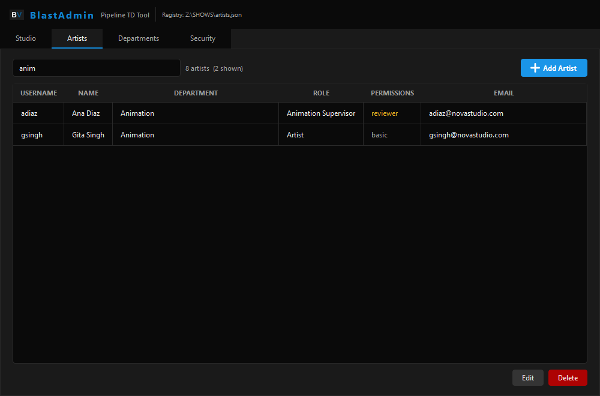
  <br><sub>Searching for “anim” filters across every field. The counter shows how many artists match.</sub>
</p>

#### Add / Edit artist dialog

<table>
  <tr>
    <td align="center">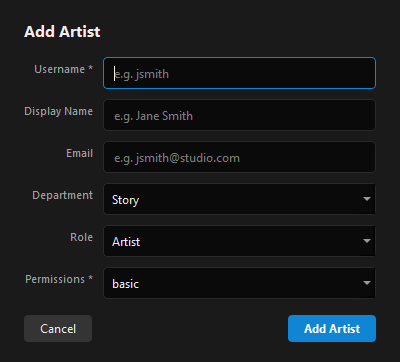<br><sub>Add Artist</sub></td>
    <td align="center">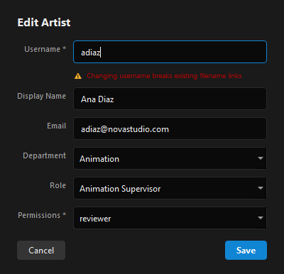<br><sub>Edit Artist</sub></td>
  </tr>
</table>

| Field             | Notes                                                                                   |
|-------------------|-----------------------------------------------------------------------------------------|
| **Username \***   | Required and unique. It is **lowercased automatically**.                               |
| **Display Name**  | If left blank, the username is used.                                                    |
| **Email**         | Optional.                                                                               |
| **Department**    | Chosen from the list on the [Departments tab](#departments-tab).                          |
| **Role**          | `Admin`, `Animation Supervisor`, `Artist`, or `TD`.                                     |
| **Permissions \*** | `admin`, `reviewer`, or `basic`. See [Permissions & Roles](#permissions--roles).         |

> ⚠️ **Changing a username is allowed but risky.** BlastVault matches filenames and session history to usernames. When you edit an artist, a red warning under the field reminds you that renaming breaks those links.

#### Deleting an artist

<p align="center">
  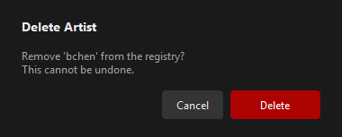
</p>

You can't undo a delete. The artist is removed from `artists.json` right away.

### Departments tab

<p align="center">
  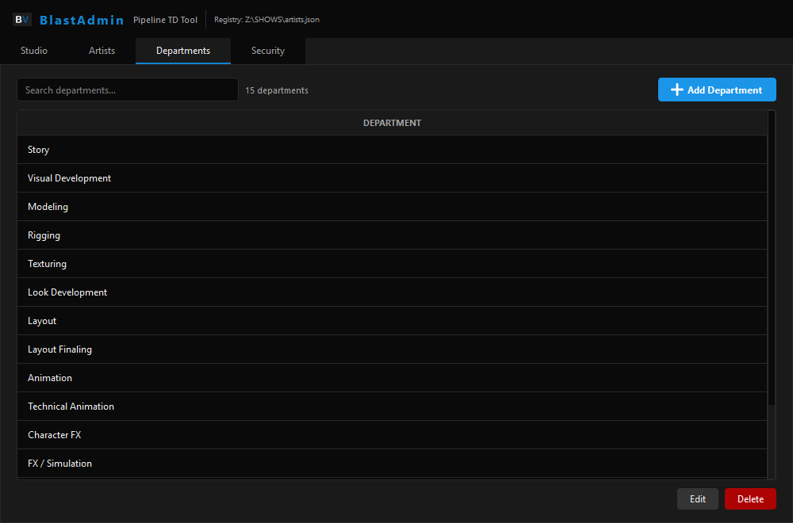
</p>

This tab manages the departments shown in the artist **Department** dropdown. It has the same search, add, edit, delete, and right-click options as the Artists tab. Duplicate names are rejected.

Default departments, grouped by pipeline stage:

| Pre-production       | 3D Asset          | Production                                                                                         |
|----------------------|-------------------|----------------------------------------------------------------------------------------------------|
| Story                | Modeling          | Layout · Layout Finaling · Animation · Technical Animation                                         |
| Visual Development   | Rigging           | Character FX · FX / Simulation · Lighting                                                          |
|                      | Texturing         | Compositing · Matte Painting                                                                       |
|                      | Look Development  |                                                                                                    |

Every change is saved to **both** `artists.json` (key `departments`) and the local config.

> ℹ️ Renaming or deleting a department **does not** update artists already assigned to it. Update those artists on the Artists tab.

### Security tab

<p align="center">
  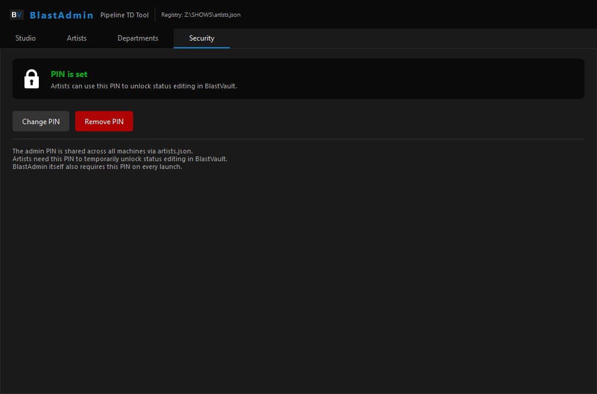
</p>

The admin PIN does two jobs:

1. It **locks BlastAdmin**. The PIN is required on every launch.
2. It **unlocks status editing in BlastVault**. Artists enter it to edit statuses temporarily.

| State        | Buttons shown                  |
|--------------|--------------------------------|
| No PIN set   | **Set PIN**                    |
| PIN is set   | **Change PIN**, **Remove PIN** |

<p align="center">
  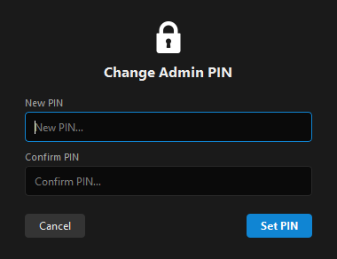
</p>

You type the new PIN twice to confirm it. The PIN is stored as a SHA-256 hash in both `artists.json` (`admin_pin_hash`) and the local config, so it applies across the studio.

---

## How Data Is Stored

### The shared registry — `artists.json`

This is the single source of truth that BlastAdmin and BlastVault share. Example:

```json
{
  "studio_name": "Nova Animation Studio",
  "admin_pin_hash": "<sha256 hex digest>",
  "departments": ["Story", "Modeling", "Animation", "Lighting", "Compositing"],
  "artists": [
    {
      "username": "adiaz",
      "name": "Ana Diaz",
      "email": "adiaz@novastudio.com",
      "department": "Animation",
      "role": "Animation Supervisor",
      "permissions": "reviewer"
    }
  ]
}
```

- When BlastAdmin writes to the file, it loads the whole registry, changes only the relevant key, and writes it back. **Top-level keys added by other tools are kept.**
- The file is pretty-printed JSON (2-space indent) in UTF-8, so it's easy to diff and review.
- `artists.json` is listed in `.gitignore`. Studio data should never be committed.

### Local config — `bladmin_config.json`

Each machine keeps its own BlastAdmin settings:

```json
{
  "studio_root": "C:\\SHOWS",
  "registry_path": "Z:\\SHOWS\\artists.json",
  "admin_pin_hash": "…",
  "studio_name": "Nova Animation Studio",
  "departments": ["Story", "Visual Development", "…"],
  "review_types": ["Director Dailies", "Head of Animation Rounds", "Supervisor Review", "CG Supervisor Review", "Final Review"]
}
```

Where the file is stored depends on how BlastAdmin is run:

| How it's run                    | Location                                           |
|---------------------------------|----------------------------------------------------|
| From source (`python main.py`)  | Project folder, next to `main.py`                  |
| Frozen executable — Windows     | `%APPDATA%\BlastAdmin\bladmin_config.json`         |
| Frozen executable — macOS       | `~/Library/Application Support/BlastAdmin/`        |
| Frozen executable — Linux       | `~/.config/BlastAdmin/`                            |

> Delete `bladmin_config.json` to see the first-run wizard again.

### How the registry path is resolved

```
registry_path  set in config?  ──yes──►  use it as-is
        │
        no
        ▼
<studio_root>/artists.json      (default studio_root: C:\SHOWS  or  ~/Shows)
```

---

## Permissions & Roles

**Permissions** set what an artist can do in BlastVault:

| Permission | Colour | Intended use                                        |
|------------|--------|-----------------------------------------------------|
| `admin`    | Blue   | Pipeline / studio administrators                    |
| `reviewer` | Amber  | Supervisors and leads who run reviews               |
| `basic`    | Grey   | Standard artist access (the default)                |

**Roles** describe the person's job and are stored for display and filtering: `Admin`, `Animation Supervisor`, `Artist`, `TD`.

BlastVault enforces what each permission level allows. BlastAdmin only stores the value.

---

## Project Structure

```
BlastAdmin/
├── main.py                    # Entry point: startup flow + MainWindow (header + tabs)
├── core/
│   ├── constants.py           # App paths, defaults, departments, roles, colour palette
│   ├── registry.py            # artists.json + bladmin_config.json read/write
│   └── styles.py              # Global Qt stylesheet (dark theme)
├── tabs/
│   ├── studio_tab.py          # Studio name + registry path
│   ├── artists_tab.py         # Artist table with CRUD, search, context menu
│   ├── departments_tab.py     # Department list CRUD
│   └── security_tab.py        # Admin PIN management
├── dialogs/
│   ├── first_run_dialog.py    # Welcome / initial setup wizard
│   ├── auth_dialog.py         # PinAuthDialog (launch) + PinSetupDialog (set/change)
│   ├── artist_dialog.py       # Add / Edit artist form
│   └── confirm_dialog.py      # Reusable styled confirm dialog
├── widgets/                   # Reserved for shared custom widgets
├── icons/                     # PNG/SVG icon set (app icon: bv.png)
└── docs/screenshots/          # Images used in this README
```

---

## Theming

All colours live in [`core/constants.py`](core/constants.py) and match BlastVault:

| Token            | Hex       | Used for                         |
|------------------|-----------|----------------------------------|
| `BG`             | `#1A1A1A` | Window background                |
| `BORDER`         | `#0a0a0a` | Header bar, inputs, cards        |
| `ACCENT`         | `#343434` | Secondary buttons, hover         |
| `ACCENT_HI`      | `#1085d3` | Primary buttons, active tab, logo text |
| `TEXT_PRI`       | `#ededed` | Primary text                     |
| `TEXT_SEC`       | `#a1a1a1` | Labels, hints                    |
| `SUCCESS`        | `#03ad14` | "File found", "PIN is set"       |
| `FAIL`           | `#ad0303` | Errors, danger buttons           |
| `SPLITTER_COLOR` | `#292929` | Dividers, table grid             |

Buttons are styled through Qt dynamic properties: `setProperty("primary", True)` gives a blue button and `setProperty("danger", True)` gives a red one. See [`core/styles.py`](core/styles.py).

---

## Packaging as an Executable

BlastAdmin detects when it's running frozen (`sys.frozen`) and moves its config to the user's app-data folder, so it works well as a standalone executable. For example, with PyInstaller:

```bash
pip install pyinstaller
pyinstaller --noconsole --name BlastAdmin --icon icons/bv.png --add-data "icons;icons" main.py
```

> On macOS/Linux, use `--add-data "icons:icons"` (colon instead of semicolon). On Windows, PyInstaller may need an `.ico` file for `--icon`.

---

## Troubleshooting

| Symptom | Cause / Fix |
|---------|-------------|
| Header shows **`⚠ file not found`** in red | The registry path doesn't exist. Check that the network drive is mapped, or set the correct path on the **Studio** tab. |
| Artists tab is empty | The registry path points to the wrong file, or the file has no `artists` key. Check the status line on the Studio tab. |
| `File found but could not be read` | `artists.json` is not valid JSON. Fix it in a text editor, or restore it from backup. |
| "Duplicate Username" warning | Usernames must be unique (case-insensitive). |
| Forgot the admin PIN | Close BlastAdmin. Remove `admin_pin_hash` (or set it to `""`) in **both** `bladmin_config.json` and `artists.json`, then relaunch and set a new PIN. |
| Want to rerun the first-run wizard | Delete the local `bladmin_config.json`. |
| `TypeError: unsupported operand type(s) for \|` on startup | You're on Python older than 3.10. Upgrade Python. |

---

## Security Notes

- The admin PIN is stored as an **unsalted SHA-256 hash**. That stops casual reading, but a short numeric PIN can be brute-forced by anyone who can read `artists.json`. Use a longer PIN, and protect the registry with network-share permissions. **Write access to `artists.json` is effectively admin access.**
- BlastAdmin trusts the filesystem. There is no server-side authentication, so anyone who can edit the registry file directly can change artists and permissions.

---

<p align="center"><sub>BlastAdmin v1.0.0 · Part of the BlastVault pipeline suite</sub></p>
